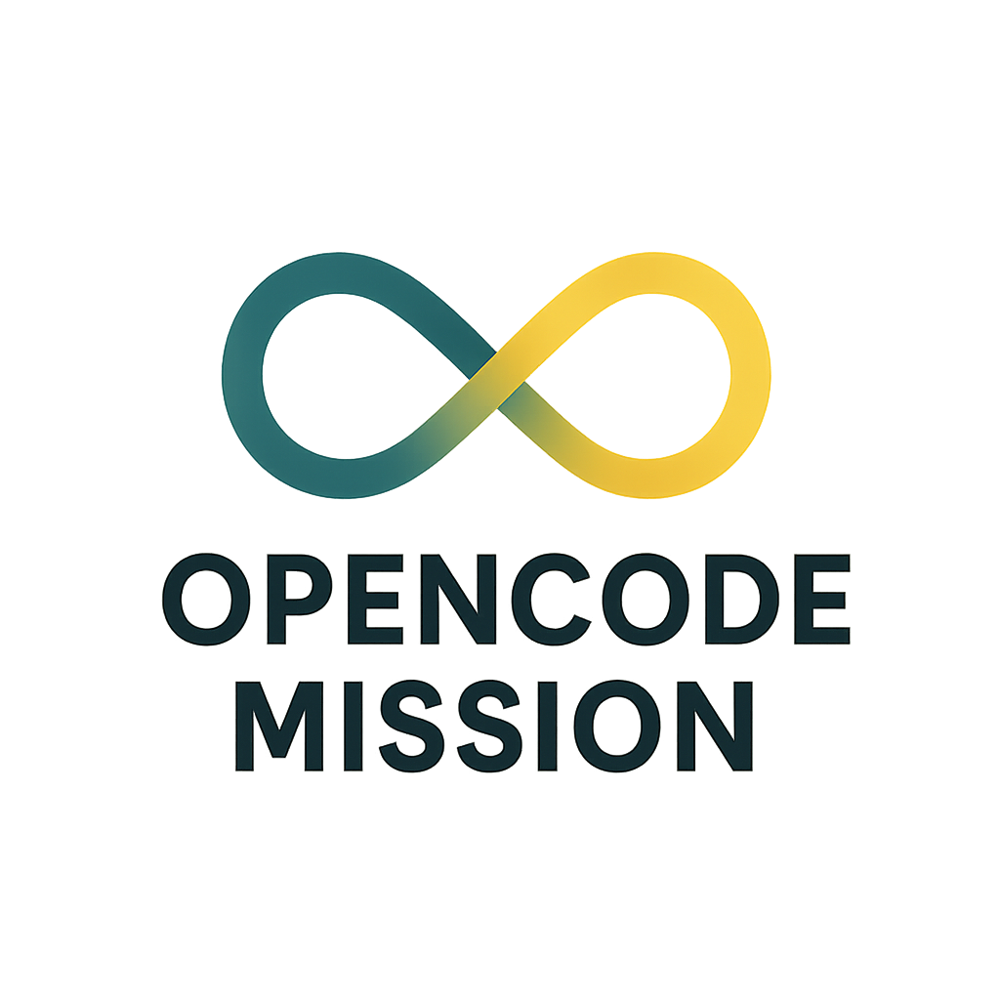

  

#  Open Code Mission

**Built to Remember. Designed to Evolve.**

Open Code Mission is your AI memory engine—purpose-built for a new era of transparency, traceability, and user sovereignty. In a world tired of black-box systems and silent surveillance, OCM offers verifiable intelligence, memory-first AI, and compliance-ready architecture.  

**🚀 Beta Launch – [Join the Waitlist »](https://airtable.com/appGVmx8iDZXgdWJI/paggBwzocV67N5E3U/form)**

--- 

## 🔎 Key Features

| Feature | Description |
|--------|-------------|
| 🔍 **Explainable Autonomy** | Every AI agent cites its sources before acting. |
| 🌐 **Enterprise-Grade Controls** | Full tenant separation, BYOK, region locks, and compliance gates. |
| 📦 **Memory Capsules** | Portable, versioned, and auditable knowledge blocks. |
| 🧾 **Traceable Reasoning** | Full audit trail from input → memory → reasoning → output. |
| 🛡 **Zero Tracking Policy** | No ads, pixels, cookies, or fingerprinting. |
| 📜 **Open Protocols** | Interoperable schemas and APIs without exposing the private runtime. |

---

## 👥 Meet the Team

| Name | Role | Highlights |
|------|------|-----------|
| **Daniel Gillespie** | CEO & Founder | AI visionary, founder of @MEGAPROMPT, pioneer in transparent memory systems |
| **Graham dePenros** | COO | 35+ years in ethics, $400M+ in exits, strategist behind AI governance |
| **Traves Theberge** | CTO | Generative AI architect, DevOps lead, expert in scalable, secure systems |

---

## 📬 Contact

Have questions? Want to collaborate?  
📧 [Contact Us](https://ocmxai.com#contact)

---

## 🛡 License

🔒 **Proprietary** – Capsule schemas, protocols, and API contracts are open. Runtime, memory engine, and orchestration logic are sealed for security and abuse prevention.

---

## 💥 Join the Mission

> No Black Boxes. No Data Harvesting.  
> Just Explainable AI You Control.

👉 [Join the Waitlist](https://ocmxai.com)  
🔗 [OpenCodeMission.com](https://ocmxai.com)

